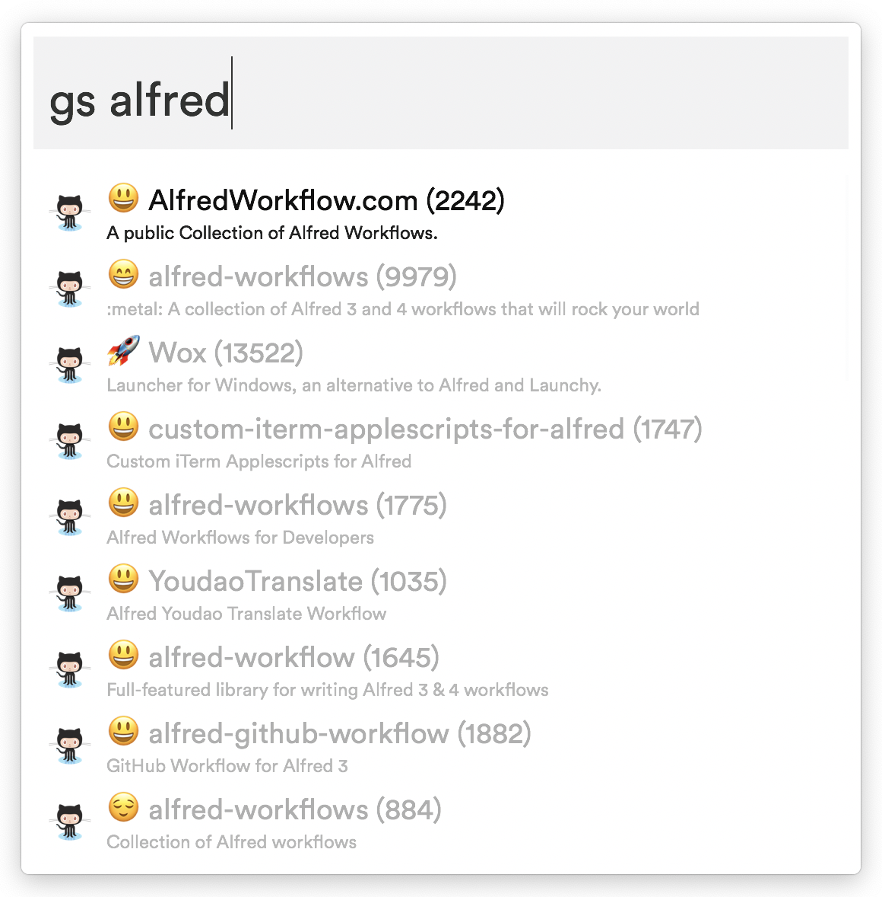

# alfred-github-search

> Alfred workflow to search github repositories, ordered by score

## Download

[Download link](https://github.com/rbaumier/alfred-github-search/blob/master/github%20search.alfredworkflow?raw=true)

_Requires the Alfred [Powerpack](https://www.alfredapp.com/powerpack/)._

## Usage

In Alfred, type `gs <your query>`. 
Press `<Enter>` to open the repository in your browser.

# What it looks like

## License

MIT © [Romain Baumier](https://twitter.com/rbaumier)
